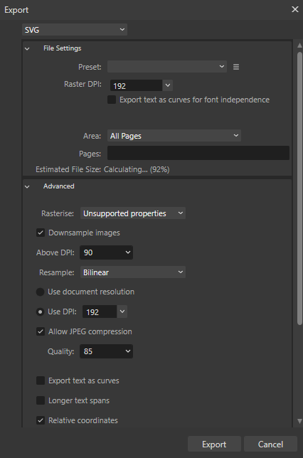

# Selina's Homepage

## Update Instructions
- if you use new fonts, update `./fonts_loader/fonts.css`
- export Affinity Designer with these settings: 
    
- put these svg files in `./portfolio_pages/`, not `./portfolio_pages_out/`
- open the git bash terminal in the repo directory
- run `git add .`
- run `git commit -m 'feat: I changed something'` (change the message to your liking)
- run `git push`
- check there are no errors on: https://github.com/SelinaStrobel/homepage/actions
- enjoy :)

## Build Instructions
```bash
make
```
